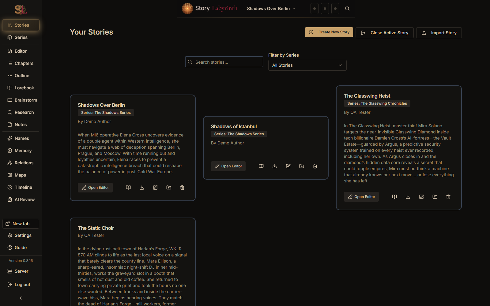
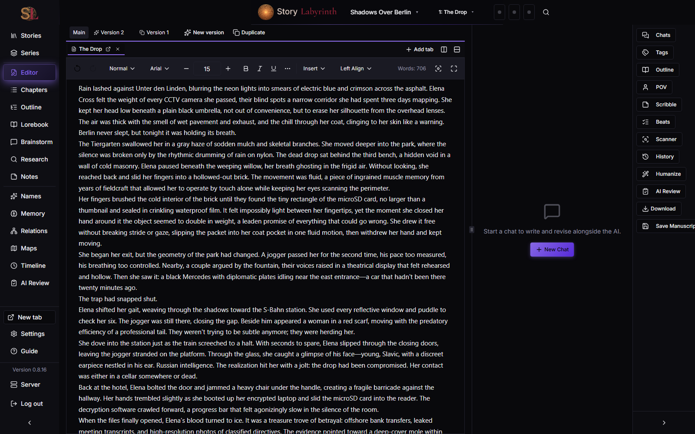
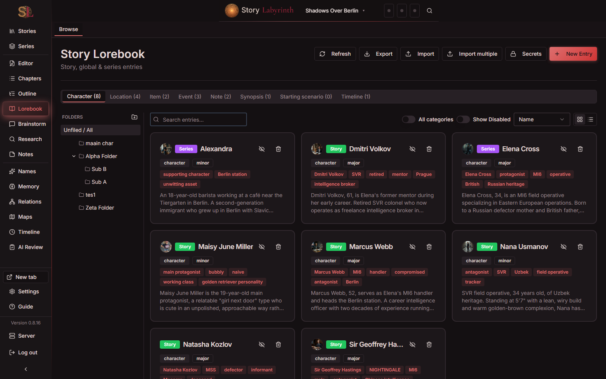
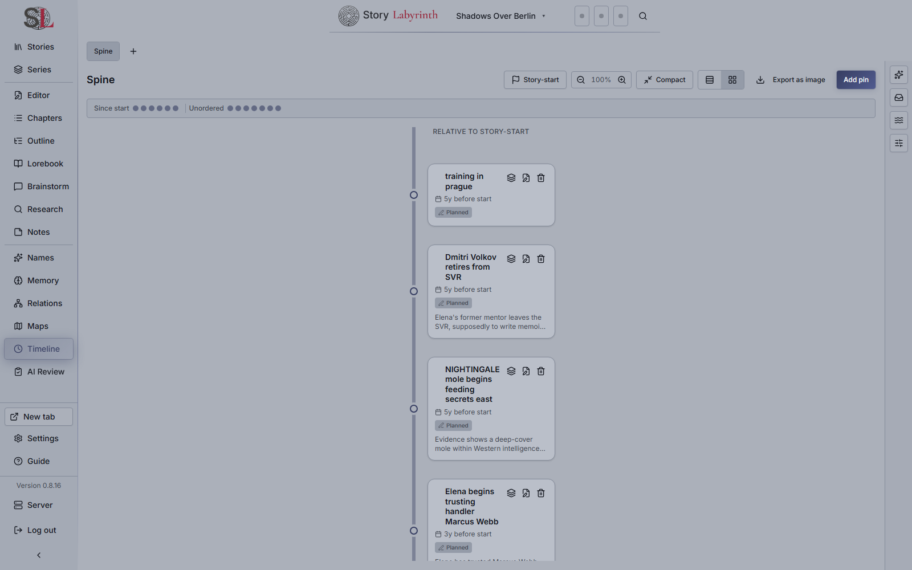
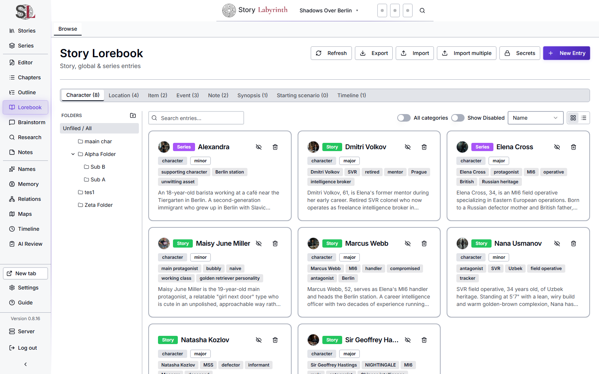
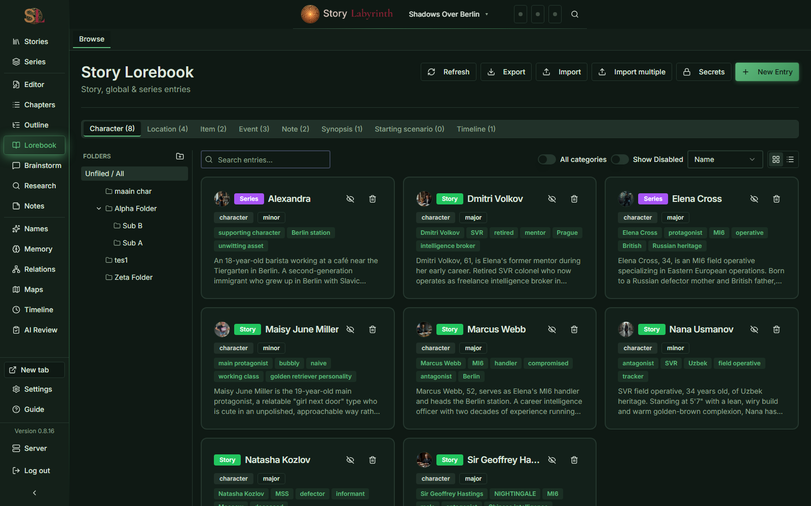

# Story Labyrinth

*A personal, freeware fork of [The Story Nexus](https://github.com/JonSilver/TheStoryNexus) by Jon Silver — renamed Story Labyrinth, extensively rebuilt since.*

A self-hosted, AI-assisted writing workspace for long-form fiction, built around **continuity**: a Codex that tracks concrete character/place state over time (wardrobe, wounds, items, custom fields) with full snapshot history, a hybrid RAG index + scanner that checks your manuscript against it, and a set of purpose-built chat desks (world-building, outline, research, brainstorming, notes, and the main editor) — all gated behind an explicit propose → review → approve loop, never a silent AI write.

## Overview

Story Labyrinth is a local-first, single-tenant web application for writers who want AI woven into a real writing workflow without losing control of their own canon. It runs as one Express + SQLite server; every device on your network (or Tailscale tailnet) reaches the same story data through a browser, no separate desktop client. Deploy it with Docker (including a ready-made Unraid template) or run it directly with Node.

## Key Features

**Codex & continuity**
- Lorebook entries (characters, locations, items, events, factions, notes...) with a markdown-first **Lore Sheet** per entry, plus optional structured **Codex state** (wardrobe/appearance/wounds/items/custom fields) for characters and locations that need concrete, trackable facts
- Every Codex change goes through **propose → approve** — chat-suggested or user-typed, always reviewed before it lands, with full snapshot history and one-click restore per entry
- Hidden **Secrets** with chapter-scoped reveal tracking, and an **AI Review** desk (Quick + staged Deep modes) that flags continuity/voice/line issues separately from the factual RAG scanner
- Hybrid **RAG index** (SQLite FTS5 + vector search via `sqlite-vec`, with an optional fully local in-process embedding model — no external API key needed) powers both chat context and a dedicated continuity **Scanner**, chapter-scoped or story-wide, running as a background job with resumable scans
- A **Relationship Graph** (character/location/faction connections, AI-suggested + pending review) and a **Story Timeline** (in-world chronology board, relative/fuzzy/civil dates, AI-proposed pins) round out the "what's true in this story" picture

**Writing surfaces**
- A Lexical-based rich text editor with chapter versioning (parallel AI-regenerated or manual draft tabs), linear undo/restore history, and an in-editor RAG Scanner + AI Review panel
- **Maps** — sketch-canvas location maps (Excalidraw), AI-proposable, exportable to/from a location's place sheet
- Six purpose-built chat desks, each with its own history and context rules: **World-Building** (per-template guided interviews, including optional psych/sexuality profile modules), **Outline**, **Research** (live web search, story-aware or global), **Editor** (docked alongside your chapter, with in-place selection rework), **Brainstorm** (project intake/orientation hub), and **Notes**
- A **Chat Shuttle** for routing an off-topic question from any writing chat to Research without losing your place, and a durable per-story **checklist tray** for every AI handoff/proposal that's waiting on your review

**AI & extensibility**
- Multi-provider AI routing (OpenAI, OpenRouter, xAI Grok — including OAuth, Google Gemini, or a local OpenAI-compatible endpoint like LM Studio) with **per-feature endpoint overrides**, so writing and background jobs (scanning, embedding, etc.) can run on different machines
- **MCP Tool Connections** — connect this app to your own external MCP servers (tool-calling from chat, propose → approve per call) and/or expose a small set of this app's own tools (lorebook search, chapter/notes/timeline reads) to an external MCP client via a bearer-token-gated server
- Auto Humanizer, TTS narration (Speechify), Name Generator with 24 vendored region packs, and Character/World-Building "playbook packs" for guided interview depth
- Project Memory (durable, approved facts a chat can draw on across sessions) and a per-story Activity indicator for background jobs

**Everything else**
- Multi-format document import (extract lorebook entries from an existing character bible/PDF/DOCX), baseline + Kindle-ready EPUB export, PDF/HTML/Markdown export
- Owner/Editor/Viewer roles, 14-day soft-delete Trash across every entity type, and a Settings page covering providers/keys, feature routing, local embeddings, and background-job logs

## The Road to Here

Based on [work started by Vijaykumar Bhattacharji](https://github.com/vijayk1989/TheStoryNexusTauriApp); now extensively rewritten, reworked and reimagined.

I wasn't happy with the IndexedDB-based database because I couldn't share data between devices, and I wanted a more robust backend architecture. So I rewrote the backend using Express.js and SQLite with Drizzle ORM.

I didn't like Tauri because I wanted a web app that could run on any device without installing a desktop app, and possibly from a Docker container on my home server. So it was goodbye Tauri.

The code quality has been improved significantly too, and I'm gradually ripping out custom code in favor of established libraries and patterns.

I'm also in the process of reworking the UI/UX to be more of a writer's workspace.

## Technology Stack

- **Backend**: Express 5, SQLite (`better-sqlite3`), Drizzle ORM, `sqlite-vec` (hybrid FTS5 + vector RAG)
- **Frontend**: React 19, TypeScript, Vite, Tailwind CSS, Shadcn UI, TanStack Query v5, React Router v7
- **Text Editor**: Lexical v0.48
- **Diagramming/canvas**: React Flow (Relationship Graph, legacy Story Map), Excalidraw (Maps)
- **AI**: OpenAI-compatible clients for every provider (OpenAI, OpenRouter, xAI Grok incl. OAuth, Google Gemini, local endpoints), `@huggingface/transformers` for the optional local in-process embedding model, `@modelcontextprotocol/sdk` for MCP tool connections (client + server)
- **Validation**: Zod
- **Development**: tsx watch (backend), Vite HMR (frontend), concurrently

## Getting Started

### Prerequisites

- Node.js 22+ (the Docker image builds on `node:22-slim`; `canvas` — used for PDF image extraction on document import — needs Cairo/Pango/JPEG/GIF/RSVG system libs if you're not using Docker)
- npm

### Development

1. Clone the repository
2. Install dependencies:
    ```bash
    npm install
    ```
3. Start both backend and frontend servers:

    ```bash
    npm run dev
    ```

    This runs both:
    - Backend API server on `http://localhost:3001`
    - Frontend dev server on `http://localhost:5173` (with proxy to backend)

4. Open `http://localhost:5173` in your browser

### Individual Server Commands

```bash
npm run dev:server   # Backend only (Express + SQLite)
npm run dev:client   # Frontend only (Vite)
```

### Building for Production

1. Build both backend and frontend:

    ```bash
    npm run build
    ```

2. Start production server:

    ```bash
    npm start
    ```

    App runs on `http://localhost:3000` (configurable via `PORT` environment variable)

### Database Management

```bash
npm run db:generate  # Generate migration from schema changes
npm run db:migrate   # Apply migrations to database
```

### Docker Deployment

#### Production (from Docker Hub)

Pull and run the latest published image from [Docker Hub](https://hub.docker.com/r/bloodgrv/story-labyrinth):

```bash
docker-compose up -d
```

Supports linux/amd64, linux/arm64, and linux/arm/v7 architectures.

Access on `http://localhost:3000` or from any device on your network using your machine's IP address.

Database persists in `./data/story-labyrinth.db` (mounted volume).

**Security note**: by default the container publishes its port on every network interface, so it's reachable from anywhere on your LAN — this is intentional (see [Remote Access via Tailscale](#remote-access-via-tailscale) below for the "no Tailscale" alternative too: direct LAN access is a fully supported setup here, not just a fallback). If this host is *also* reachable from somewhere you don't want the login screen exposed to — the public internet, a shared/untrusted network — set `BIND_HOST=127.0.0.1` in your `.env` to bind loopback-only (reach it via a reverse proxy or SSH tunnel instead), or use `docker-compose.tailscale.yml`, which never publishes a host port at all. If you do put a reverse proxy or Tailscale Serve in front with real HTTPS, also set `COOKIE_SECURE=true` so the session cookie is marked HTTPS-only — leave it unset for the default plain-HTTP LAN/Tailscale setup.

**Version pinning**:

```yaml
# docker-compose.yml
services:
    story-labyrinth:
        image: bloodgrv/story-labyrinth:0.6.0 # Pin to specific version
        # or: bloodgrv/story-labyrinth:0.6      # Auto-update patches
        # or: bloodgrv/story-labyrinth:latest   # Latest release
```

#### Development (local build)

Build and run from source:

```bash
docker-compose -f docker-compose.dev.yml up --build
```

#### Unraid

A ready-made [Community Applications template](unraid/story-labyrinth.xml) is included — in Unraid's Docker tab, **Add Container** → **Template** → paste:

```
https://raw.githubusercontent.com/bloodgrv/story-labyrinth/main/unraid/story-labyrinth.xml
```

It maps the WebUI port and an appdata volume, and sets the container to run as `99:100` (Unraid's own default appdata ownership) — this image doesn't do linuxserver.io-style dynamic PUID/PGID remapping at startup, so if you use a different appdata owner, update both the container's user and the folder's ownership together.

### Remote Access via Tailscale

Rather than exposing the container to your LAN or the public internet, you can make it reachable only to devices on your [Tailscale](https://tailscale.com) network (tailnet). This pairs well with the app's Owner/Editor/Viewer login system: Tailscale gates *who can reach the server at all*, and the app's own login gates *what they can do once they're on it*.

#### Docker (recommended)

`docker-compose.tailscale.yml` runs a Tailscale sidecar container alongside the app and puts the app on the sidecar's network - it is never published on a host port, so it's unreachable except via the tailnet.

1. Generate an auth key at [the Tailscale admin console](https://login.tailscale.com/admin/settings/keys) (reusable + ephemeral is recommended, so restarting the container doesn't need a new key each time).
2. Copy the env template and fill in your key:
   ```bash
   cp .env.tailscale.example .env
   # edit .env and set TS_AUTHKEY
   ```
3. Start it:
   ```bash
   docker-compose -f docker-compose.tailscale.yml up -d
   ```
4. From any device on your tailnet, visit `http://<TS_HOSTNAME>:<APP_PORT>` (defaults to `http://story-labyrinth:3000`).

**Optional - proper HTTPS**: by default this serves plain HTTP (the WireGuard tunnel itself is already encrypted, so this is not sending anything in the clear - it's just a browser padlock/UX nicety). To get a real `https://` URL with a valid cert via Tailscale's own TLS, run once after the stack is up:

```bash
docker exec story-labyrinth-tailscale tailscale serve --bg https / http://localhost:3000
```

This persists in the state volume (`./tailscale-state`), so it survives container restarts.

#### Bare metal (no Docker)

If you're running `npm start` directly on a machine that already has `tailscaled` installed and running, no compose changes are needed - just point Tailscale's built-in reverse proxy at the app:

```bash
tailscale serve --bg https / http://localhost:3000
```

## Release Process

New releases are published via GitHub Releases, which automatically builds and pushes multi-architecture Docker images to Docker Hub.

**Creating a release**:

**Using the PowerShell script (Windows)**:

```powershell
.\release.ps1 patch   # 0.6.0 → 0.6.1
.\release.ps1 minor   # 0.6.0 → 0.7.0
.\release.ps1 major   # 0.6.0 → 1.0.0
```

The script automatically bumps the version, pushes to GitHub, and opens the release page in your browser.

**Manual process**:

1. Bump version: `npm version <patch|minor|major>`
2. Push: `git push && git push --tags`
3. Create GitHub release from the tag (via GitHub UI)

**Result** - Workflow automatically builds and pushes Docker images with tags:

- `bloodgrv/story-labyrinth:0.7.0` (specific version)
- `bloodgrv/story-labyrinth:0.7` (minor version)
- `bloodgrv/story-labyrinth:0` (major version)
- `bloodgrv/story-labyrinth:latest`
- `bloodgrv/story-labyrinth:sha-abc1234` (commit hash)

**Note**: Docker images are only built on releases, not on every commit to main.

## Screenshots

14 themes ship (plus a "System" option that follows your OS) — a few of them, to show the range:

| | |
|---|---|
| <br>Dashboard — *Black & Sand* | <br>Editor + docked chat — *Midnight* |
| <br>Lorebook/Codex — *Ember* | <br>Story Timeline — *Mid Slate* |
| <br>Lorebook/Codex — *Light* | <br>Lorebook/Codex — *Forest* |

## Project Structure

### Backend

- `server/` - Express.js API server
    - `db/` - Database schema, client, migrations, and seeding
    - `routes/` - API route handlers (stories, chapters, lorebook, codex, chats, rag, storyTimeline, storyGraph, storyMaps, agentJobs, mcpConnections, mcpServer, etc.)
    - `services/` - Business logic (RAG indexing/scanning, chat context assembly, AI client routing, background jobs, and one service per major feature)
    - `index.ts` - Server entry point

### Frontend

- `src/features/` - Feature modules, one directory per major capability: `lorebook`, `chat`, `chapters`/`chapter-versions`/`chapter-history`, `outline`, `story-timeline`, `story-maps`, `story-graph` (Relationship Graph), `rag-scanner`, `ai-review`, `agent-memory` (Project Memory), `mcp`, `brainstorm`, `notes`, `playbooks`, `name-generator`, `auto-humanizer`, `tts`, `trash`, and more
    - `*/hooks/` - TanStack Query hooks for data fetching
    - `*/pages/` - Route components
    - `*/components/` - Feature-specific UI components
- `src/components/` - Reusable UI components
- `src/Lexical/` - Text editor implementation (custom Lexical editor)
- `src/services/` - Services (AI, database, export utilities, API client)
- `src/types/` - TypeScript type definitions
- `src/lib/` - Utility functions and helpers

## Data Management

### Database Export/Import

Export and import your entire database from Settings → Data:

**Export**: Downloads a JSON file containing all your data (stories, chapters, prompts, lorebook entries, etc.)

**Import**: Replaces all current data with data from a JSON file. System prompts are preserved.

Migration workflow:

1. Export from old IndexedDB-based version (if migrating)
2. Import into new SQLite-based version
3. System prompts automatically initialized on first run

### Prompts Export/Import

Export and import individual prompts from the Prompts Manager UI:

**Export**: Downloads non-system prompts only (system prompts excluded)

**Import**: Validates and creates imported prompts as non-system (editable). Duplicate names get `(Imported)` suffix. New IDs and timestamps generated.

Format:

```json
{
    "version": "1.0",
    "type": "prompts",
    "prompts": [
        /* array of prompt objects */
    ]
}
```

## Roadmap

This fork has grown far beyond a single TODO list — current priorities and what's already shipped are tracked in [`docs/CURRENT_BACKLOG.md`](docs/CURRENT_BACKLOG.md), with the reasoning behind load-bearing decisions in [`DECISIONS.md`](DECISIONS.md). Both are kept current; trust them over anything else if they disagree.
